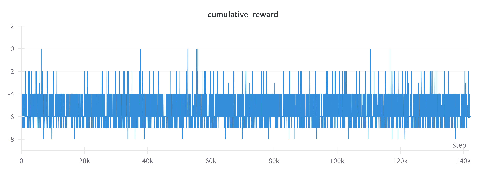
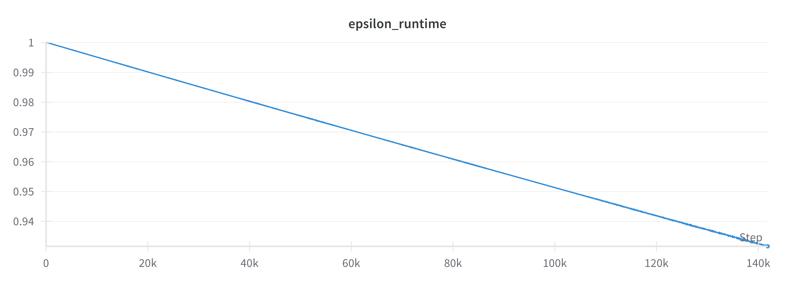
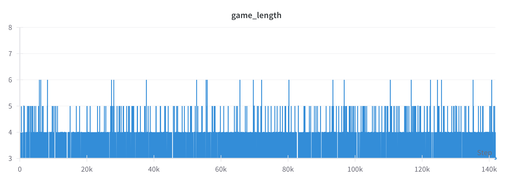
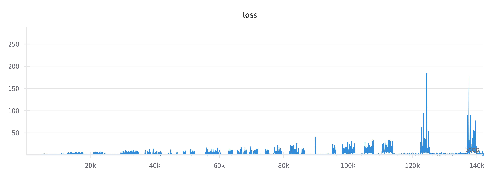
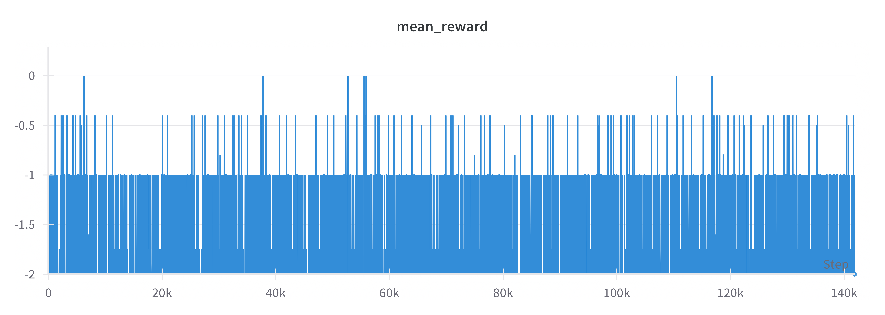
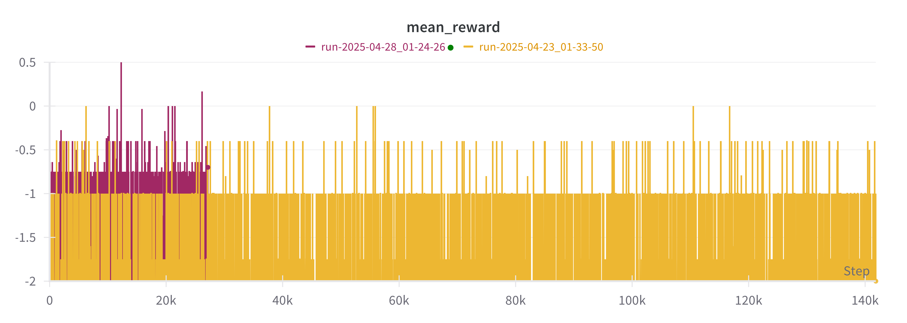

# Uno-RL Agent

Uno-RL is a Deep Q-Learning-based reinforcement learning agent trained to play the game of Uno from scratch using a custom-built environment and reward system.

This project showcases the application of deep reinforcement learning to a multi-player, turn-based card game utilizing TensorFlow/Keras, experience replay, target networks, and integrated logging via TensorBoard and Weights & Biases.

---

## Project Overview

| Attribute       | Details                         |
|-----------------|---------------------------------|
| **Training Time** | 109.5 hours                  |
| **Frameworks**    | TensorFlow, Keras, Wandb, Numpy |
| **RL Algorithm**  | Deep Q-Network (DQN)           |
| **Environment**   | Custom Uno Game Engine         |
| **Logging**       | TensorBoard, Weights & Biases  |

The agent underwent training over 140,000+ steps, utilizing experience replay, target network synchronization, and epsilon-greedy exploration.

---

## Key Components

### Custom Uno Environment
- Full gameplay logic includes:
  - Regular and special cards (Skip, Reverse, Draw Two, Wild, Wild Draw Four)
  - Turn-based mechanics with reversible directions
  - Draw pile management
- **State Representation:**
  - Current top card (one-hot encoding)
  - Player hand card counts
  - Cards to draw information
- **Action Space:**
  - Play a specific card
  - Draw a card

### Reward Structure

**Initial rewards (first run):**
- Illegal move: `-2`
- Drawing a card: `-1`
- Playing a card: `+2`
- Winning the game: `+10`

**Updated rewards (second run improvements):**
- Illegal move: `-2`
- Drawing a card: `-0.2`
- Playing a card: `+1`
- Playing special cards: `+2`
- Having 2 cards left (Near Win): `+2`
- Having 1 card left (Almost Win): `+5`
- Winning the game: `+10`

### Model and Training
- **Q-Network:** MLP (Multi-layer Perceptron) trained using Mean Squared Error (MSE) loss.
- **Replay Buffer:** Stores 10,000 most recent transitions
- **Batch Size:** 512
- **Discount Factor (γ):** 0.7
- **Learning Rate:** 1e-4
- **Target Network Updates:** Every 20 steps
- **Model Saves:** Every 20,000 steps

### Epsilon-Greedy Exploration
- Initial epsilon: `1.0`
- Minimum epsilon: `0.05`
- Decay rate: `0.995`

---

## Results

### Cumulative Reward vs Steps



Cumulative reward remains mostly negative (around -6 on average), indicating the agent learns survival but rarely wins under the initial reward system.

### Epsilon Decay



Smooth decay from 1.0 to approximately 0.94 over 140,000 steps, reflecting a gradual shift from exploration towards exploitation.

### Game Length



Most games conclude within 4-5 moves, indicating quick resolution or early stabilization.

### Loss Curve



Loss remains generally low, though periodic spikes occur likely due to memory refreshes or rare game events.

### Mean Reward



Mean reward is consistently negative (~ -1), indicating the original reward structure's limited success in promoting winning strategies.

---

## Future Improvements (In Progress)

### Reward Engineering
Enhanced reward structure to encourage strategic gameplay:
- Positive incentives for nearing win conditions.
- Additional rewards for strategic special card usage.

### Updated Training
- Second run completed using improved reward system.
- Comparative analysis of mean rewards:



Early results indicate improved learning with revised rewards, evidenced by increased mean reward.

---

## How to Run

### 1. Install Dependencies
```bash
pip install -r requirements.txt
```

### 2. Train the Agent
```bash
python train.py
```

### 3. Visualize Logs
```bash
tensorboard --logdir=logs/
```

### 4. Optional Visualization via Weights & Biases

Ensure WandB is enabled for comprehensive metrics visualization.

---

## Folder Structure

| Folder/File       | Purpose                         |
|-------------------|---------------------------------|
| `agent.py`        | Main DQN agent                  |
| `environment.py`  | Custom Uno environment          |
| `train.py`        | Training loop                   |
| `models/`         | Saved model checkpoints         |
| `logs/`           | TensorBoard logs                |
| `wandb/`          | Weights & Biases tracking (optional) |

---

## Acknowledgements
- Reinforcement learning concepts based on *Sutton & Barto’s* "Reinforcement Learning: An Introduction".
- TensorFlow/Keras official documentation.
- Adaptation of Uno card game rules tailored for reinforcement learning.

---

✨ **Notes:**
- Total training duration: 109.5 hours across multiple sessions.
- Ensured consistent model-saving intervals to mitigate interruptions.
- Environment designed as fully self-contained; no external Uno engines required.

